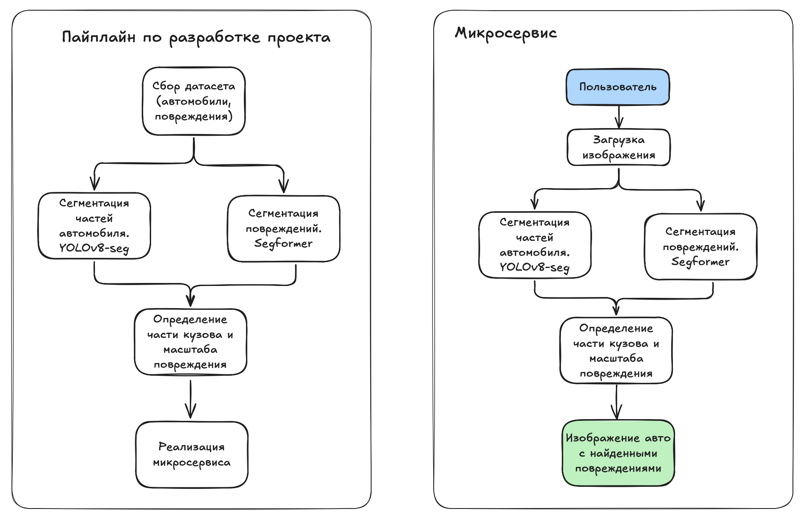

# Схема решения и метрики

В качестве решения проблемы необходимо разработать сервис автоматического определения повреждений на кузове автомобиля по фотографии. Пользователь загружает изображение машины, система анализирует его, выявляет визуальные дефекты (например, вмятины, царапины, трещины), определяет, на какой части кузова они находятся, и оценивает их относительный масштаб. На основе полученной информации можно отображать в объявлении данные о реальном состоянии автомобиля или использовать её для автоматической модерации, если повреждение серьёзное и не указано пользователем.

В рамках проекта планируется автоматическое обнаружение наиболее типичных визуальных повреждений кузова автомобиля. Система будет распознавать следующие категории дефектов:

 - *Царапины* — неглубокие линейные повреждения лакокрасочного покрытия, которые хорошо различимы при определённом освещении.

 - *Вмятины* — деформации кузова без нарушения целостности металла.

 - *Трещины* — структурные нарушения целостности, в первую очередь на пластиковых элементах: бамперах, фарах, внешних накладках.

 - *Сквозные повреждения* — крупные пробои, дыры или разрушения деталей. Такие повреждения могут затрагивать как металл, так и пластик и часто сопровождаются визуальным нарушением геометрии кузова.

## Пайплайн по разработке проекта

**1. Подготовка данных**

   Сбор и анализ датасета. Поиск изображений автомобилей различных марок при различных условиях освещенности, поиск изображений автомобилей как с повреждениями так и без них. EDA.

**2. Сегментация частей автомобиля**

   Разметка частей автомобиля необходима для того, чтобы в будущем можно было не просто обнаружить дефект, но и точно определить, на какой именно детали он находится. Для этой задачи будет использоваться модель **YOLOv8-seg**. После подготовки данных модель обучается на размеченных изображениях. Для оценки качества её работы применяются метрики **IoU** по каждому классу и среднее значение **mIoU**. Эти метрики позволяют оценить, насколько хорошо модель выделяет контуры каждой части, и обеспечивают уверенность в том, что при дальнейшем сопоставлении с дефектами границы деталей автомобиля точно будут известны.

**3. Сегментация повреждений**

   Следующим этапом является обучение модели, которая будет отвечать за локализацию самих повреждений. Для этого используется архитектура **SegFormer**, предназначенная для задач семантической сегментации. В данной постановке дефект выделяется как один класс, и модель должна научиться выделять на изображении именно те пиксели, которые ему соответствуют. Чтобы достичь точного результата, особенно с учётом того, что повреждений может быть мало и они часто малозаметны, применяются метрики **IoU** и **Dice coefficient**. Dice коэффициент особенно полезен в ситуациях, где повреждённые области составляют малую часть изображения, поскольку он чувствителен к перекрытию малых объектов. На этом этапе задача — научить модель различать реальное повреждение от фона, света, отражений и других визуальных шумов.

**4. Определение части кузова и масштаба повреждения**

   После того как обе модели обучены и работают на новых изображениях, необходимо объединить их предсказания. Маска, полученная от модели сегментации повреждений, накладывается на маску, полученную от модели сегментации частей автомобиля. Это позволяет определить, на какой именно детали машины находится дефект. Для этого анализируется пересечение масок, и повреждение привязывается к той части кузова, на которую приходится наибольшее количество перекрывающихся пикселей. Далее оценивается масштаб повреждения — его можно определить как отношение площади маски дефекта к площади маски соответствующей части автомобиля. Такой способ позволяет оценивать повреждения независимо от масштаба изображения и ракурса, при условии, что часть машины видна целиком.

**5. Реализация микросервиса**

   Чтобы использовать полученную систему на практике, необходимо реализовать микросервис, который будет принимать изображение автомобиля, обрабатывать его и возвращать результат. В качестве фреймворка при проектировании сервиса будет использоваться **FastAPI**. Ответ должен быть возвращён не дольше чем за 500 мс.

## Метрика оценки качества работы системы
Цель проекта - разработать модель, для автоматического поиска повреждений автомобиля, при этом особенно важно находить автомобили с существующими, но не заявленными продавцом, повреждениями. Необходимо не допустить факт скрытия повреждения продавцом и не пропустить такой автомобиль в продажу. Поэтому для оценки эффективности модели будет оптимизироваться количество автомобилей, на фотографиях которых повреждения были обнаружены корректно.
